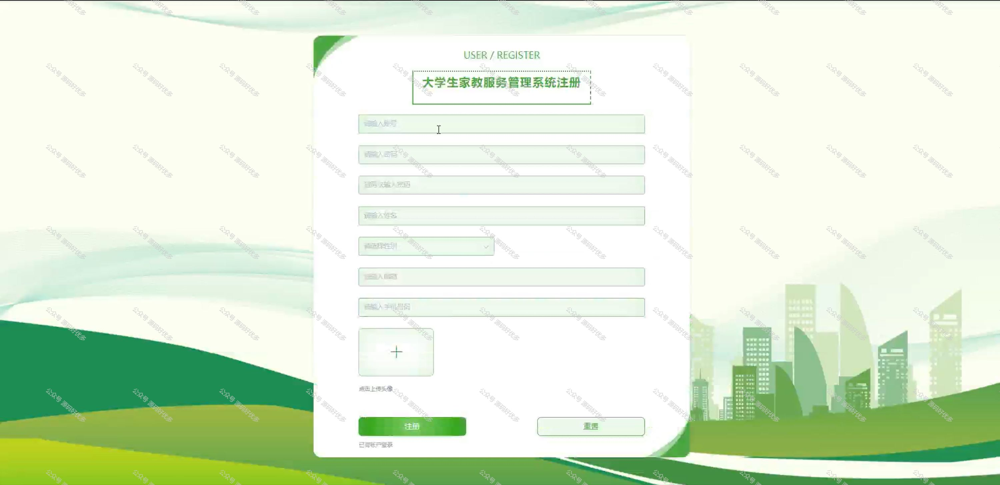
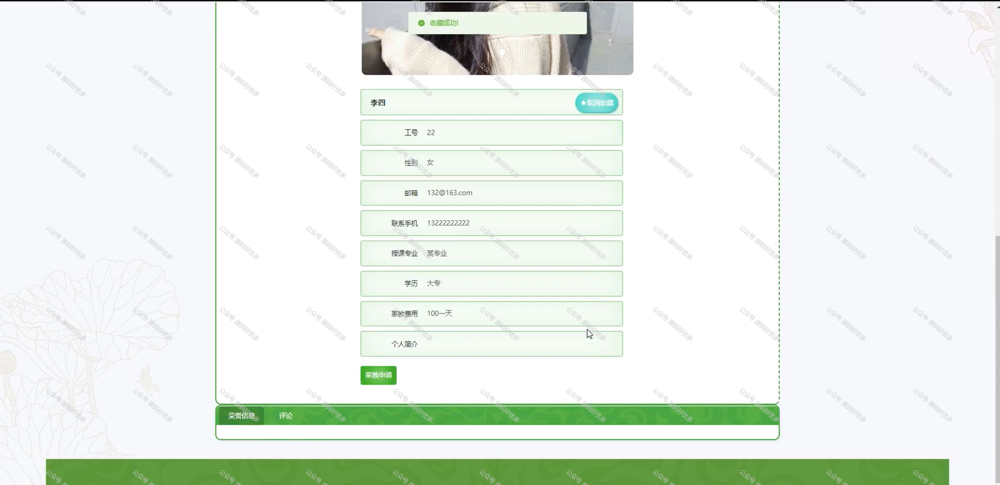
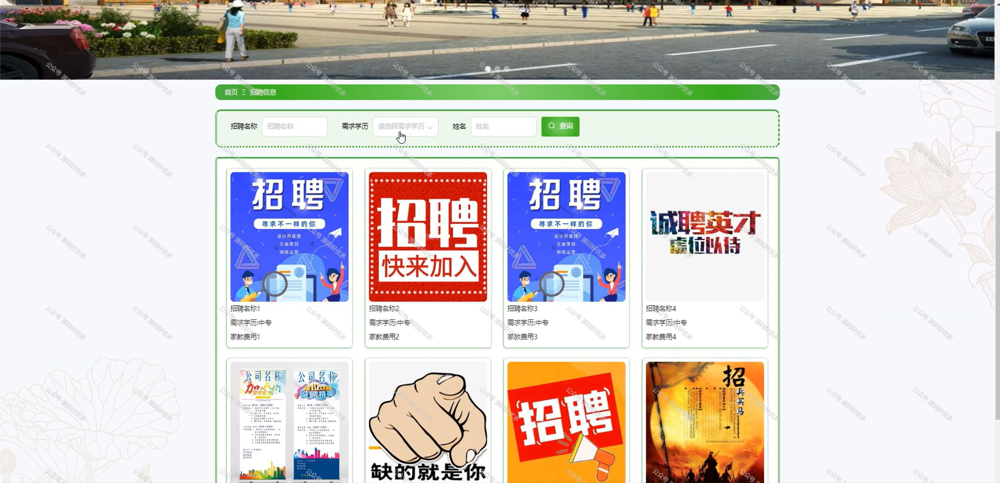
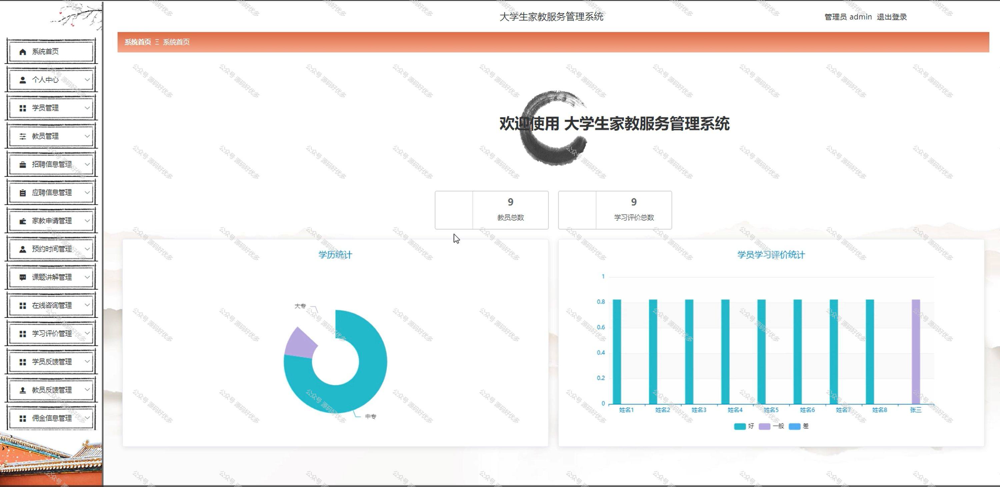
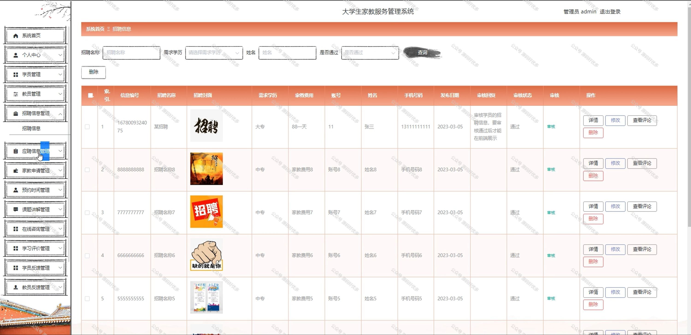

 
## 查看主页获取源码

> **作者介绍**： **✌**全网粉丝10W+本平台特邀作者、博客专家、CSDN新星计划导师、java领域优质创作者,博客之星、掘金/华为云/阿里云/InfoQ等平台优质作者、专注于项目实战 **✌**

  

### 一、作品包含

源码+数据库+全套环境和工具资源+部署教程

### 二、项目技术

前端技术：Html、Css、Js、Vue、Element-ui

数据库：MySQL

后端技术：Java、Spring Boot、MyBatis

  

### 三、运行环境

开发工具：IDEA/eclipse

数据库：MySQL5.7

数据库管理工具：Navicat10以上版本

环境配置软件： JDK1.8+Maven3.6.3

前端Nodejs：14

### 四、项目介绍
项目编号：springbootA137

在高校教育日益普及和家庭教育投入不断增加的背景下，大学生家教服务管理系统应运而生，该系统旨在为大学生提供便捷的家教信息发布与匹配平台，同时为提供优质家教资源的筛选与预约服务，通过信息化管理提高家教服务的效率和质量，促进家教市场的规范化和透明化，满足双方对家教服务的需求。

前台分为学员和教员
学员功能：登录注册、首页、教员、招聘信息、公告信息、后台管理、个人中心、我的收藏。
教员功能：登录注册、首页、教员、招聘信息、公告信息、后台管理、个人中心、我的收藏。

后台分为管理员、学员、教员
管理员的功能：系统首页、个人中心、学员管理、教员管理、招聘信息管理、应聘信息管理、家教申请管理、预约时间管理、课题讲解管理、在线咨询管理、学习评价管理、学员反馈管理、教员反馈管理。
学员的功能：系统首页、个人中心、招聘信息管理、应聘信息管理、家教申请管理、预约时间管理、课题讲解管理、在线咨询管理、学习评价管理、学员反馈管理。
教员的功能：系统首页、个人中心、教员管理、应聘信息管理、家教申请管理、预约时间管理、课题讲解管理、在线咨询管理、学习评价管理、教员反馈管理、佣金信息管理。
### 五、运行截图

  
